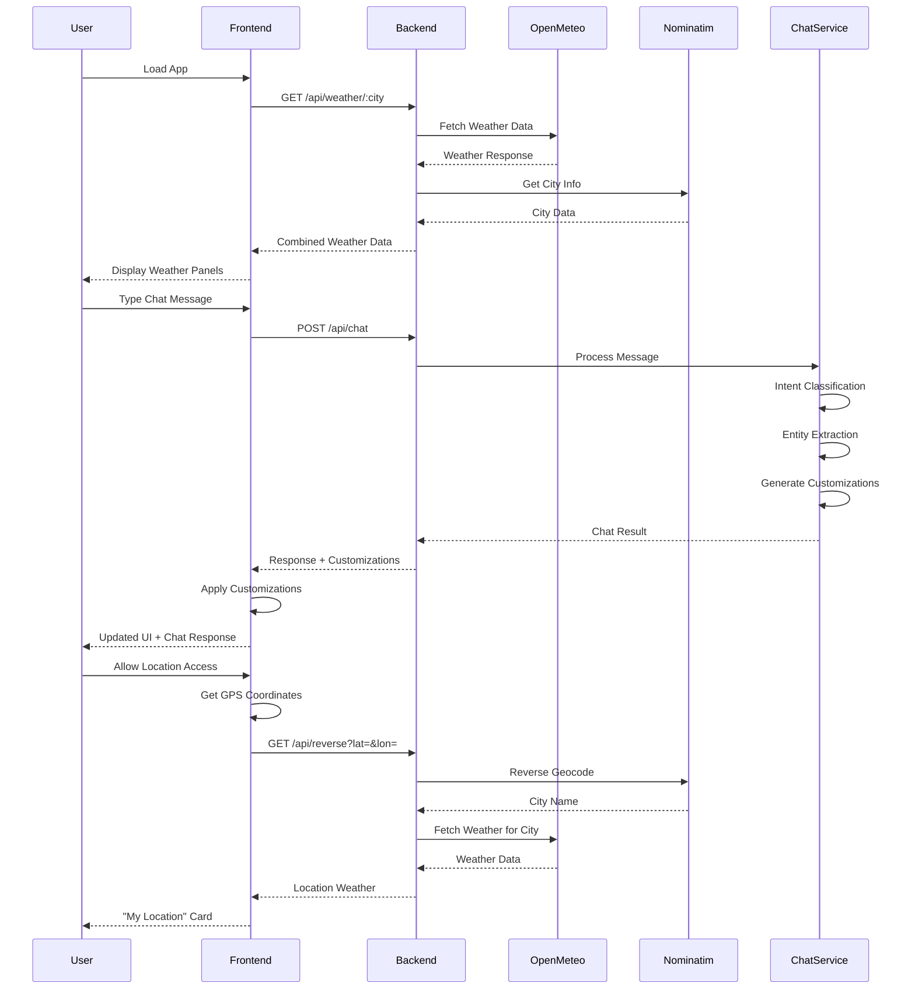
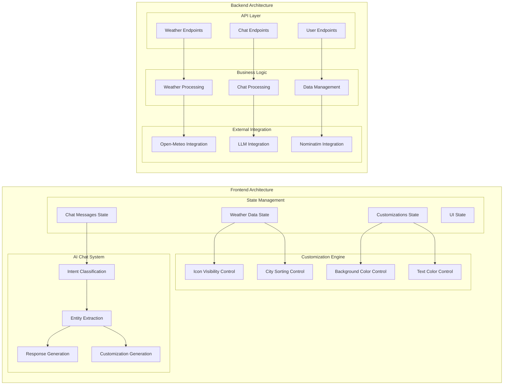

# Weather App - Architecture Diagram & Flow

## System Architecture Overview

```mermaid
graph TB
    %% User Interface Layer
    subgraph "Frontend (React + TypeScript + Vite)"
        UI[User Interface]
        ChatUI[AI Chat Interface]
        WeatherUI[Weather Panels]
        CustomUI[Customization Engine]
    end

    %% Frontend Components
    subgraph "Frontend Components"
        App[App.tsx<br/>Main Application]
        WeatherPanel[WeatherPanel.tsx<br/>City Weather Display]
        ChatPanel[ChatPanel.tsx<br/>AI Chat Interface]
        ChatToggle[ChatToggle.tsx<br/>Chat Toggle Button]
        WeatherService[weatherService.ts<br/>API Client]
    end

    %% Backend Layer
    subgraph "Backend (Node.js + Express + TypeScript)"
        Server[server.ts<br/>Express Server]
        Routes[API Routes]
        Controllers[Controllers]
        Services[Services]
    end

    %% Backend Components
    subgraph "Backend Components"
        WeatherController[weatherController.ts<br/>Weather API Handler]
        ChatController[chatController.ts<br/>Chat API Handler]
        UserController[userController.ts<br/>User Management]
        WeatherService[weatherService.ts<br/>Weather Data Processing]
        ChatService[chatService.ts<br/>AI Chat Processing]
        DataService[dataService.ts<br/>Data Management]
    end

    %% External APIs
    subgraph "External APIs"
        OpenMeteo[Open-Meteo API<br/>Weather Data]
        Nominatim[Nominatim API<br/>Geocoding]
        LLM[LLM Service<br/>AI Processing<br/>(Future Phase 4)]
    end

    %% Data Storage
    subgraph "Data Storage"
        LocalStorage[Browser LocalStorage<br/>User Preferences]
        JSONFiles[JSON Files<br/>User Data]
        Memory[In-Memory Cache<br/>Weather Data]
    end

    %% Connections
    UI --> App
    ChatUI --> ChatPanel
    WeatherUI --> WeatherPanel
    CustomUI --> App

    App --> WeatherService
    App --> ChatPanel
    WeatherPanel --> WeatherService
    ChatPanel --> ChatService

    WeatherService --> Server
    ChatService --> Server

    Server --> Routes
    Routes --> Controllers
    Controllers --> Services

    WeatherController --> WeatherService
    ChatController --> ChatService
    UserController --> DataService

    WeatherService --> OpenMeteo
    WeatherService --> Nominatim
    ChatService --> LLM

    App --> LocalStorage
    DataService --> JSONFiles
    WeatherService --> Memory

    %% Styling
    classDef frontend fill:#e1f5fe
    classDef backend fill:#f3e5f5
    classDef external fill:#fff3e0
    classDef storage fill:#e8f5e8

    class UI,ChatUI,WeatherUI,CustomUI,App,WeatherPanel,ChatPanel,ChatToggle,WeatherService frontend
    class Server,Routes,Controllers,Services,WeatherController,ChatController,UserController,WeatherService,ChatService,DataService backend
    class OpenMeteo,Nominatim,LLM external
    class LocalStorage,JSONFiles,Memory storage
```

## Data Flow Diagram



## Component Architecture



## Technology Stack

```mermaid
graph TB
    subgraph "Frontend Stack"
        React[React 18]
        TypeScript[TypeScript]
        Vite[Vite Build Tool]
        Tailwind[Tailwind CSS]
        Axios[Axios HTTP Client]
    end

    subgraph "Backend Stack"
        NodeJS[Node.js]
        Express[Express.js]
        TypeScript_Back[TypeScript]
        CORS[CORS Middleware]
        DotEnv[DotEnv Config]
    end

    subgraph "Development Tools"
        Jest[Jest Testing]
        Playwright[Playwright E2E]
        ESLint[ESLint]
        Prettier[Prettier]
    end

    subgraph "External Services"
        OpenMeteo_Service[Open-Meteo API]
        Nominatim_Service[Nominatim API]
        LLM_Service[LLM Service]
    end

    React --> TypeScript
    TypeScript --> Vite
    Vite --> Tailwind
    Tailwind --> Axios

    NodeJS --> Express
    Express --> TypeScript_Back
    TypeScript_Back --> CORS
    CORS --> DotEnv

    Jest --> Playwright
    Playwright --> ESLint
    ESLint --> Prettier

    OpenMeteo_Service --> Nominatim_Service
    Nominatim_Service --> LLM_Service
```



## Current Implementation Status

### ✅ Completed Features
- **Weather Display**: 7-day forecasts for multiple cities
- **City Management**: Add/remove cities with validation
- **Geolocation**: "My Location" weather card
- **AI Chat Interface**: Natural language GUI customization
- **Icon Control**: Show/hide weather icons
- **Background Colors**: Dynamic background color changes
- **City Sorting**: Sort by temperature, population, alphabetical
- **Text Colors**: Dynamic text color changes
- **Responsive Design**: Mobile and desktop optimized
- **Automated Testing**: Playwright-based frontend validation

#### Recent Completions (2024-12-19)
- **Playwright Frontend Validation**: Added automated frontend testing to startup protocol
  - **Date**: 2024-12-19
  - **Components**: tests/weather.spec.ts, playwright.config.ts
  - **APIs**: N/A (testing layer)
  - **Technical Solution**: Created Playwright test to validate frontend loads correctly with proper elements
  - **Test Coverage**: Header verification, button presence, weather panel count validation

- **Background Color Customization Fix**: Resolved Tailwind CSS override issues using direct CSS injection
  - **Date**: 2024-12-19
  - **Components**: App.tsx, App.css, index.css
  - **APIs**: /api/chat (background color processing)
  - **Technical Solution**: Implemented CSS injection into `<head>` with ultra-high specificity

- **City Sorting Enhancement**: Fixed sorting logic to use correct CSS selectors
  - **Date**: 2024-12-19
  - **Components**: App.tsx (applyCitySorting function)
  - **APIs**: /api/chat (sorting commands)
  - **Technical Solution**: Updated selectors to target actual DOM elements (.text-3xl, .text-gray-600, h2)

- **Text Color Customization**: Implemented comprehensive text color control system
  - **Date**: 2024-12-19
  - **Components**: App.tsx (applyCustomization function), backend chatService.ts
  - **APIs**: /api/chat (text color processing)
  - **Technical Solution**: Enhanced text color detection and application to all text elements within weather panels

- **Complete Reset System**: Implemented comprehensive reset functionality for all customizations
  - **Date**: 2024-12-19
  - **Components**: App.tsx (resetCityOrder function), backend chatService.ts
  - **APIs**: /api/chat (reset all processing)
  - **Technical Solution**: Added city order restoration to reset all functionality, ensuring complete UI state restoration

- **Background Color Enhancement**: Added red background support to complete color palette
  - **Date**: 2024-12-19
  - **Components**: backend chatService.ts
  - **APIs**: /api/chat (background color processing)
  - **Technical Solution**: Extended background color handlers to include red (#ef4444) alongside existing blue and green options

- **Reset All Button Fix**: Enhanced top-right reset button to perform comprehensive reset
  - **Date**: 2024-12-19
  - **Components**: App.tsx (resetAllCustomizations function)
  - **APIs**: N/A (frontend-only functionality)
  - **Technical Solution**: Updated reset button to call comprehensive reset function that handles all customization types including city order restoration

- **Server Management Enhancement**: Improved server startup and restart automation
  - **Date**: 2024-12-19
  - **Components**: restart-servers.bat, restart-servers.ps1, launch-restart-servers.bat (triple script approach)
  - **APIs**: N/A (infrastructure tool)
  - **Technical Solution**: Enhanced batch script with robust process killing, PowerShell alternative for better process management, and user-friendly launcher for double-click execution, automatic port checking, and server restart functionality for both backend (port 5000) and frontend (port 5173)

- **Architecture Documentation**: Created comprehensive system architecture diagrams
  - **Date**: 2024-12-19
  - **Components**: weather-app-architecture.md
  - **APIs**: N/A
  - **Technical Solution**: Mermaid diagrams for system overview, data flow, and component architecture

### 🔄 In Progress
- **Enhanced AI Understanding**: Intent classification and entity extraction
- **Customization Types**: Expanding supported customization types

### ⏳ Planned (Phase 4)
- **LLM Integration**: Full AI service integration
- **Advanced Customizations**: Layout changes, animations
- **Undo/Redo**: Customization history management
- **Hourly Forecasts**: 24-hour detailed forecasts
- **Weather Alerts**: Alert notifications system

## Key Architectural Decisions

1. **Separation of Concerns**: Clear separation between frontend UI, backend API, and external services
2. **Rule-Based AI**: Current chat system uses rule-based processing for reliability
3. **Progressive Enhancement**: AI features built incrementally with fallback systems
4. **Type Safety**: Full TypeScript implementation across frontend and backend
5. **Modular Design**: Component-based architecture for maintainability
6. **External API Integration**: Leverages Open-Meteo and Nominatim for weather data
7. **Local Storage**: Browser-based persistence for user preferences
8. **Real-time Updates**: Dynamic UI updates through React state management

## Security & Performance Considerations

- **CORS Configuration**: Proper cross-origin resource sharing
- **Input Validation**: Server-side validation for all API inputs
- **Error Handling**: Comprehensive error handling and user feedback
- **Caching Strategy**: In-memory caching for weather data
- **Rate Limiting**: Consideration for external API rate limits
- **Data Privacy**: Local storage for user preferences only
